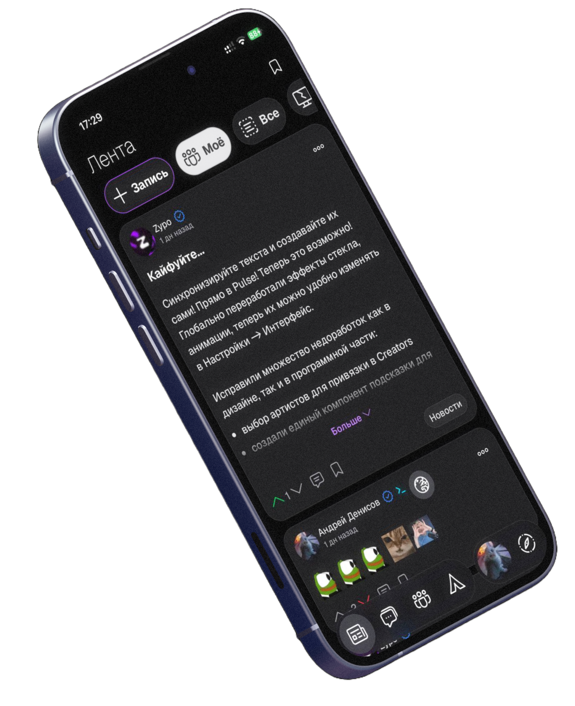
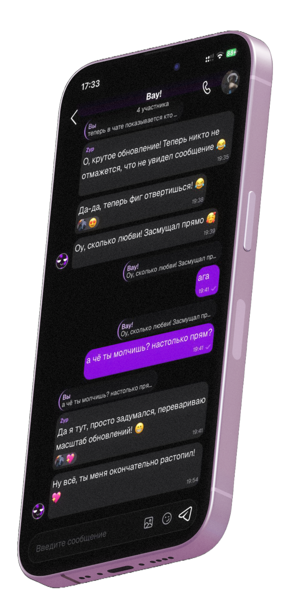
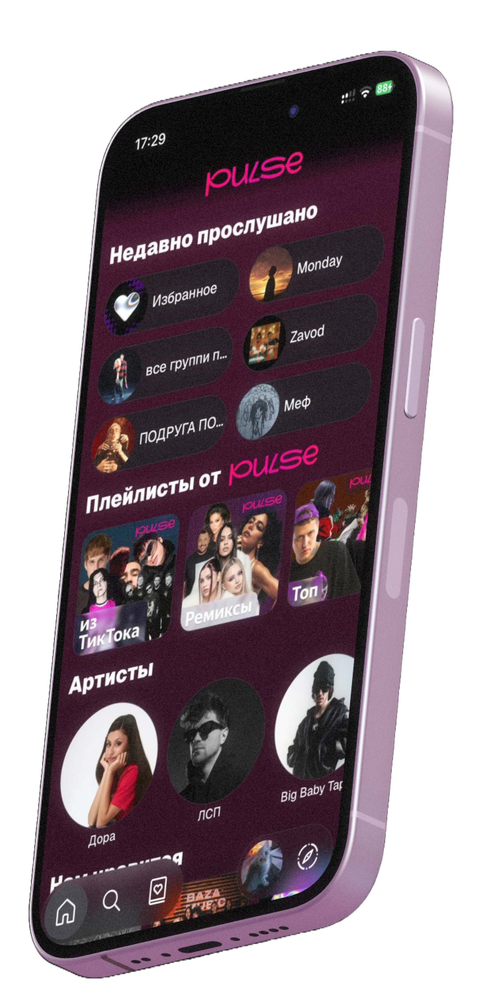
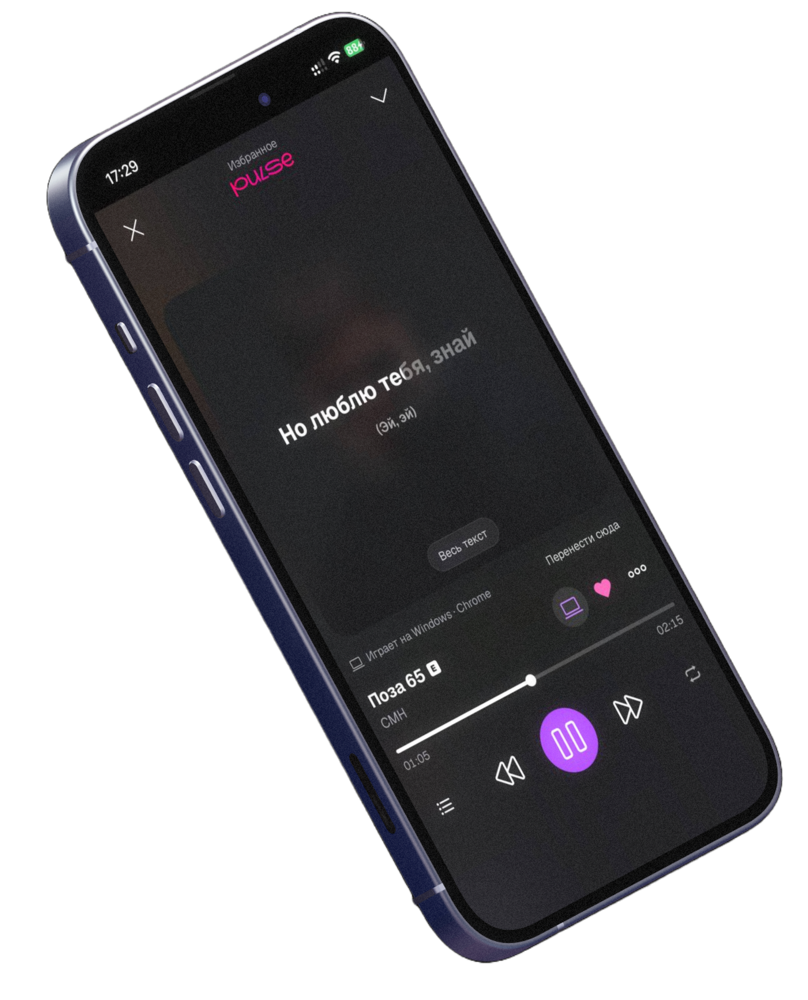

<p align="center">
  
</p>

<h1 align="center">Zypo</h1>

<p align="center">
  Социальная сеть всё-в-одном: лента, чаты и звонки, музыка Pulse, кино, кошелёк и мини-приложения.<br />
  Основной клиент платформы — сайт, PWA и приложения для Android и iPhone из одного кода.
</p>

<p align="center">
  <a href="https://github.com/DenisovPlay/ancial/releases/latest"></a>
  <a href="LICENSE"></a>
</p>

<p align="center">
  
  
  
  
  
</p>

<p align="center">
  
  
  
  
  
</p>

<p align="center">
  <a href="https://zypo.cc"><b>zypo.cc</b></a> ·
  <a href="https://github.com/DenisovPlay/ancial/releases/latest">Скачать приложение</a> ·
  <a href="https://t.me/zypocc">Telegram</a>
</p>

<p align="center">
  
  
</p>
<p align="center">
  
  
</p>

## Что внутри

| Раздел | Что умеет |
|---|---|
| **Лента** | Посты с картинками, опросами и музыкой, комментарии со стикерами, закладки, закреплённые посты, подписки на друзей и сообщества |
| **Чаты и звонки** | Личные и групповые диалоги, голосовые, стикеры, групповые звонки, черновики между устройствами |
| **Pulse** | Музыкальный сервис: плейлисты, тексты песен, радио по треку, дневные подборки, «Вейв», «Не интересно», офлайн-режим, совместное прослушивание |
| **Кинотеатр** | Каталог фильмов и сериалов, история и прогресс просмотра |
| **Друзья и сообщества** | Заявки, «Сейчас онлайн», «Возможные», роли и права в сообществах |
| **Кошелёк** | Баланс, переводы, история операций |
| **Приложения и игры** | Мини-приложения внутри платформы |
| **AMC** | Админ-панель на бэкенде (модерация, настройки, аудит) |
| **Безопасность** | 2FA, passkeys, сессии на устройствах, подтверждение почты и телефона |

Дополнительно: уведомления (web push и нативный FCM) с группировкой, офлайн-режим и кэш (Service Worker + IndexedDB), настройка эффектов стекла и анимаций, русский, английский и белорусский интерфейс.

## Приложение для телефона

Последняя версия — на странице [Releases](https://github.com/DenisovPlay/ancial/releases/latest) и на [zypo.cc/app/mobile](https://zypo.cc/app/mobile).

| Платформа | Как установить |
|---|---|
| **Android** | Скачайте `Zypo-*.apk`, откройте файл и разрешите установку из этого источника |
| **iPhone** | Скачайте `Zypo-*.ipa` (без подписи) и установите через AltStore, Sideloadly или TrollStore со своим сертификатом. Уведомления в iOS-версии недоступны |
| **PWA** | Откройте [zypo.cc](https://zypo.cc) в Chrome (Android) или Safari (iPhone) → «Установить приложение» / «На экран „Домой“» |

Приложение само проверяет версию при запуске и предложит обновиться, когда на GitHub выйдет релиз новее. Версии вида `3.9.5b` — хотфиксы: `3.9.5 < 3.9.5a < 3.9.5b < 3.9.6`.

## Технологии

- **Next.js 16** (App Router) и **React 19** — сайт и статический экспорт для приложений
- **TypeScript 5**, **Tailwind CSS 4**, **framer-motion**
- **Capacitor 8** — Android и iOS из того же кода
- **Service Worker** — офлайн, кэш, push
- **ESLint 9** с «нулевым долгом» (ratchet) и встроенный `node --test`
- Бэкенд — PHP V2-API (отдельный репозиторий), WebSocket-сервер для чатов и звонков

## Быстрый старт

Нужны **Node.js 22+** и npm.

```bash
git clone https://github.com/DenisovPlay/ancial.git
cd ancial
npm ci
npm run dev        # http://localhost:3000
```

Адреса бэкенда, WebSocket и сайта заданы в одном месте — [`app/config.ts`](app/config.ts). `next.config.ts` проксирует `/api`, `/includes`, `/pay` на бэкенд, поэтому CORS при разработке не мешает. Файл `.env` не нужен.

### Скрипты

| Команда | Что делает |
|---|---|
| `npm run dev` | Режим разработки |
| `npm run build` / `npm start` | Продакшн-сборка сайта и её запуск |
| `npm run build:app` | Статический экспорт для приложений → `out/` |
| `npm test` | Тесты (`node --test`) |
| `npm run lint` / `npm run lint:ratchet` | Линтер; ratchet не пропускает ни одной новой ошибки |
| `npm run android:debug` | Отладочный APK |
| `npm run release:android` / `release:ios` / `release:all` | APK/IPA для релиза → `release/Zypo-<версия>.*` |
| `npm run ios:device` | Собрать и поставить на подключённый iPhone |

Перед пул-реквестом должно быть зелёным всё:

```bash
npx tsc --noEmit && npm run lint:ratchet && npm test && npm run build
```

## Сборка приложений

Версия берётся из `version` в `package.json` (например `3.9.12b`) — для Android `versionCode`, для iOS номер сборки.

### Android

Нужны JDK 17+ и Android SDK.

```bash
npm run android:debug      # android/app/build/outputs/apk/debug/app-debug.apk
npm run release:android    # release/Zypo-<версия>.apk
```

Release подписывается `android/keystore.properties` (`storeFile`, `storePassword`, `keyAlias`, `keyPassword`; файл не коммитится). Без него APK получится неподписанным.

### iOS

Нужны macOS и Xcode, CocoaPods не нужен (Swift Package Manager). Платный аккаунт разработчика не требуется.

```bash
npm run ios:device         # сборка и установка на iPhone (подпись бесплатным Personal Team, профиль живёт 7 дней)
npm run release:ios        # release/Zypo-<версия>.ipa — без подписи, для AltStore/Sideloadly/TrollStore
```

Для `ios:device` войдите в Apple ID в Xcode (Settings → Accounts), подключите телефон и включите «Режим разработчика».

### Релиз

1. Поднимите `version` в `package.json`, соберите `npm run release:all`.
2. Создайте релиз на GitHub с тегом, **равным версии** (`3.9.12b` или `v3.9.12b`), приложите `.apk` и `.ipa`:
   ```bash
   gh release create 3.9.12b release/Zypo-3.9.12b.apk release/Zypo-3.9.12b.ipa --title 3.9.12b
   ```
3. Бэкенд (`info/AppConfig.php`) подхватит версию и прямые ссылки на файлы в течение 10 минут — страница `/app/mobile` и проверка обновлений в приложении заработают сами. `min_version` для принудительного обновления настраивается в AMC.

## Структура проекта

```
ancial/
├── app/                  # Сайт и приложение (App Router)
│   ├── feed/  profile/  group/  friends/  messages/  call/
│   ├── pulse/            # Музыка: плеер, плейлисты, Вейв, радио, creators
│   ├── cinema/  wallet/  apps/  games/  settings/  about/
│   ├── components/       # Общие компоненты (AppImage, Modal, навигация…)
│   ├── context/          # Auth, уведомления, плеер Pulse
│   ├── hooks/  lib/      # Хуки и общие функции
│   ├── locales/          # Переводы ru / en / be
│   └── config.ts         # Домены бэкенда и сайта
├── public/               # Статика, Service Worker, иконки
├── android/  ios/        # Нативные проекты Capacitor
├── scripts/              # Сборка приложения, релизы, ratchet линтера
├── tests/                # Тесты (node --test), структура повторяет app/
├── DeployUbuntu/         # Скрипт авто-деплоя на сервер
├── Dockerfile  docker-compose.yml
└── AGENTS.md             # Правила кода и дизайн-код проекта
```

Правила кода, дизайн-код (скругления, отступы, «наше стекло») и архитектурные заметки по каждому разделу собраны в [`AGENTS.md`](AGENTS.md).

## Деплой

Сайт собирается в Docker (`Dockerfile`, standalone-режим Next.js, BuildKit-кэш `npm` и `.next/cache` для быстрых пересборок) и поднимается через `docker-compose.yml` на `127.0.0.1:3000`. Наружу его отдаёт Nginx. Авто-деплой по изменениям в репозитории — `DeployUbuntu/check-deploy.sh` (инструкция в [`DeployUbuntu/README.md`](DeployUbuntu/README.md)). HTML отдаётся с `Cache-Control: no-store`, чтобы прокси не хранил разметку старой сборки.

Бэкенд (PHP V2-API, миграции БД, мост к музыкальным сервисам) живёт в отдельном репозитории и выкладывается независимо от клиента.

## Вклад в проект

1. Создайте ветку для новой функциональности.
2. Следуйте правилам из `AGENTS.md` (дизайн-код, переводы только через `app/locales`, без `any`).
3. Убедитесь, что проходят `tsc`, `lint:ratchet`, `npm test` и `npm run build`.
4. Отправьте пул-реквест.

## Лицензия

Проект распространяется под лицензией **MIT**: можно использовать код в личных и коммерческих целях, изменять, распространять и применять в закрытых проектах.

**Условия:**
- при распространении кода или его частей сохраняйте уведомление об авторских правах и текст лицензии;
- раздел `/about` (история, технологии, контакты, гайды, документы) нельзя удалять или изменять; добавлять новую информацию в него можно;
- код предоставляется «как есть», без каких-либо гарантий.

Полный текст — в файле [LICENSE](LICENSE).

## Контакты

- Сайт: [zypo.cc](https://zypo.cc)
- Telegram: [t.me/zypocc](https://t.me/zypocc)
- Email: [contact@zypo.cc](mailto:contact@zypo.cc)
